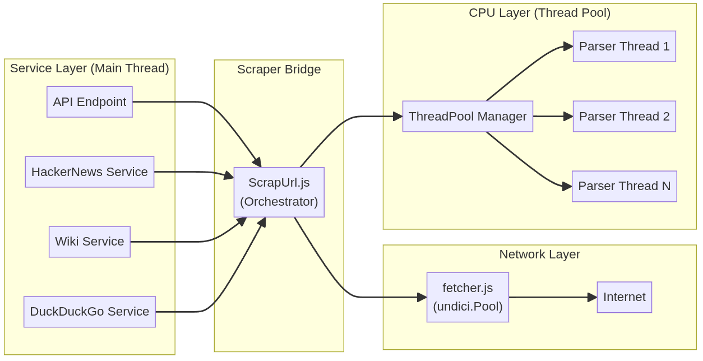

# Searqon Scraper Architecture

Searqon uses a high-performance, distributed scraping engine designed for low latency and high throughput. It is built on Node.js and leverages **Worker Threads** for CPU-intensive tasks and **Undici** for optimized network operations.

## Architecture Overview

The system is designed to handle real-time search and scraping requests without blocking the main event loop.

### Key Components

1. **Service Layer** (`services/`):
   - Handles specific platform logic (DuckDuckGo, Wiki, HackerNews, etc.).
   - Orchestrates search + scrape workflows.
   - Calls the `ScrapUrl` bridge.

2. **ScrapUrl Bridge** (`scrapper/ScrapUrl.js`):
   - The unified entry point for all scraping needs.
   - Coordinates fetching (IO) and parsing (CPU).

3. **Network Layer** (`scrapper/fetcher.js`):
   - Uses `undici.Pool` to maintain persistent connections to origins.
   - Reuse TCP connections (Keep-Alive) to eliminate handshake latency.
   - Handles compression (br, gzip) and redirects automatically.

4. **Parser Thread Pool** (`scrapper/worker.js`):
   - Maintains a pre-warmed pool of worker threads.
   - Size = `Total CPU Cores - 1` (max 8).
   - Offloads HTML parsing (Readability + Linkedom) to prevent blocking the main server.

---

## Data Flow Diagram



---

## Technical Highlights

### 1. Zero-Blocking Architecture
Node.js is single-threaded. CPU-heavy tasks like parsing 100KB of HTML would block the server for 10-50ms, causing lag for all users.
- **Solution**: We spawn `N-1` background threads.
- **Result**: The main thread *only* handles coordination. Parsing happens in parallel on separate CPU cores.

### 2. Connection Pooling
Opening a new SSL connection takes time (DNS + TCP Handshake + TLS Handshake).
- **Solution**: We use `undici.Pool`.
- **Result**: Subsequent requests to the same site (e.g. repeated fetching from Wikipedia) reuse the existing connection, dropping latency by ~50-100ms per request.

### 3. Automatic Scaling
The scraping engine inspects the host machine's hardware at startup:
```javascript
const POOL_SIZE = Math.max(2, Math.min(os.cpus().length - 1, 8));
```
It automatically scales to utilize available hardware without overwhelming the system.
