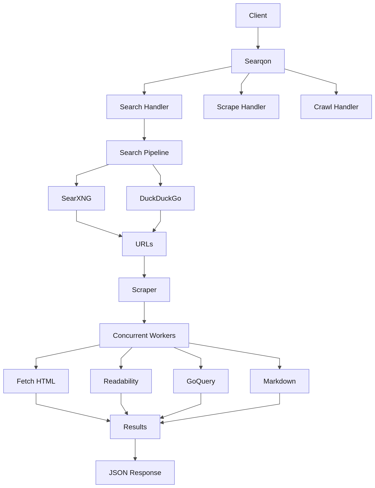

# Architecture

---

## Overview

Searqon is a **single Go process** running on port `4001`. It exposes an HTTP JSON API that handles the full web intelligence pipeline — from query parsing to clean content extraction.



---

## Component Breakdown

### `main.go` — Entry Point
Registers all HTTP routes and starts the server. No business logic here.

```
/search        → searchHandler()
/scrape        → scrapeHandler()
/scrape/batch  → batchScrapeHandler()
/scrape/html   → scrapeHTMLHandler()
/crawl         → crawlHandler()
/map           → mapHandler()
/health        → healthHandler()
```

---

### `search.go` — Search Aggregator + Pipeline

**Two providers in a fallback chain:**

| Provider | How | When |
|---|---|---|
| **SearXNG** | GET `localhost:8080/search?format=json` | Primary (if running) |
| **DuckDuckGo Lite** | GET `html.duckduckgo.com/html/` + goquery parse | Fallback |

**Scraping stage:**
- Fires N goroutines simultaneously (no semaphore queuing)
- Global `2.5s context deadline` — returns whatever completed, snippet fallback for the rest
- Capped at **top 3 pages** to minimise latency

---

### `scraper.go` — Page Content Extractor

Two-strategy extraction pipeline per URL:

```
Strategy 1: go-readability
  → Article detection + title extraction
  → htmlToMarkdown() conversion
  → Returns if content > 100 chars

Strategy 2: goquery fallback
  → Removes noise selectors (nav, footer, ads, scripts)
  → Walks h1-h6, p, li, blockquote, pre, td
  → Returns cleaned joined text + markdown
```

Also handles:
- `gzip`, `brotli`, `deflate` decompression
- 5MB response body limit
- Binary content-type rejection

---

### `crawler.go` — Site Crawler

BFS-based site crawler:
- Starts from a seed URL
- Follows internal links only (same hostname)
- Configurable `limit` (max pages) and `depth` (link depth)
- Deduplicates visited URLs
- Supports SSE streaming (`stream: true`) for real-time page delivery

---

### `handlers.go` — HTTP Request/Response Models

All request and response structs live here:
- `ScrapeRequest`, `ScrapeResult`
- `BatchScrapeRequest`
- `MapRequest`, `MapResult`
- `CrawlRequest`, `CrawlResult`
- `HTMLScrapeRequest`

---

### `utils.go` — Shared Utilities

- `cleanText()` — Normalise whitespace
- `countWords()` — Word count
- `extractTitleFromHTML()` — Regex title extraction
- `noiseSelectors` — CSS selectors to strip from pages

---

## Data Flow: `/search` with `scrape: true`

```
POST /search { query: "golang channels", limit: 5, scrape: true }
     │
     ├─ 1. Try SearXNG at localhost:8080
     │       ↓ (if offline)
     ├─ 2. Try DuckDuckGo Lite HTML endpoint
     │       ↓
     │    Returns: [{ title, url, snippet }, ...]
     │
     ├─ 3. Take top 3 URLs
     │    Fire 3 goroutines simultaneously:
     │       goroutine 1 → fetch url[0] → readability → markdown
     │       goroutine 2 → fetch url[1] → readability → markdown
     │       goroutine 3 → fetch url[2] → readability → markdown
     │
     │    Global 2.5s deadline:
     │       Fast page → content + markdown injected into result
     │       Slow/blocked page → uses snippet from Step 2
     │
     └─ 4. Return JSON:
          { query, provider, total, duration, results: [...] }
```

---

## Performance

| Metric | Value |
|---|---|
| Idle RAM | ~20MB |
| Cold start | <100ms |
| Search only (`scrape: false`) | ~1.5–2s |
| Search + scrape (`scrape: true`) | ~3.5–4.5s |
| Max scrape timeout per page | 3s |
| Global scrape deadline | 2.5s |
| Max concurrent scrapes | 3 (top results) |
