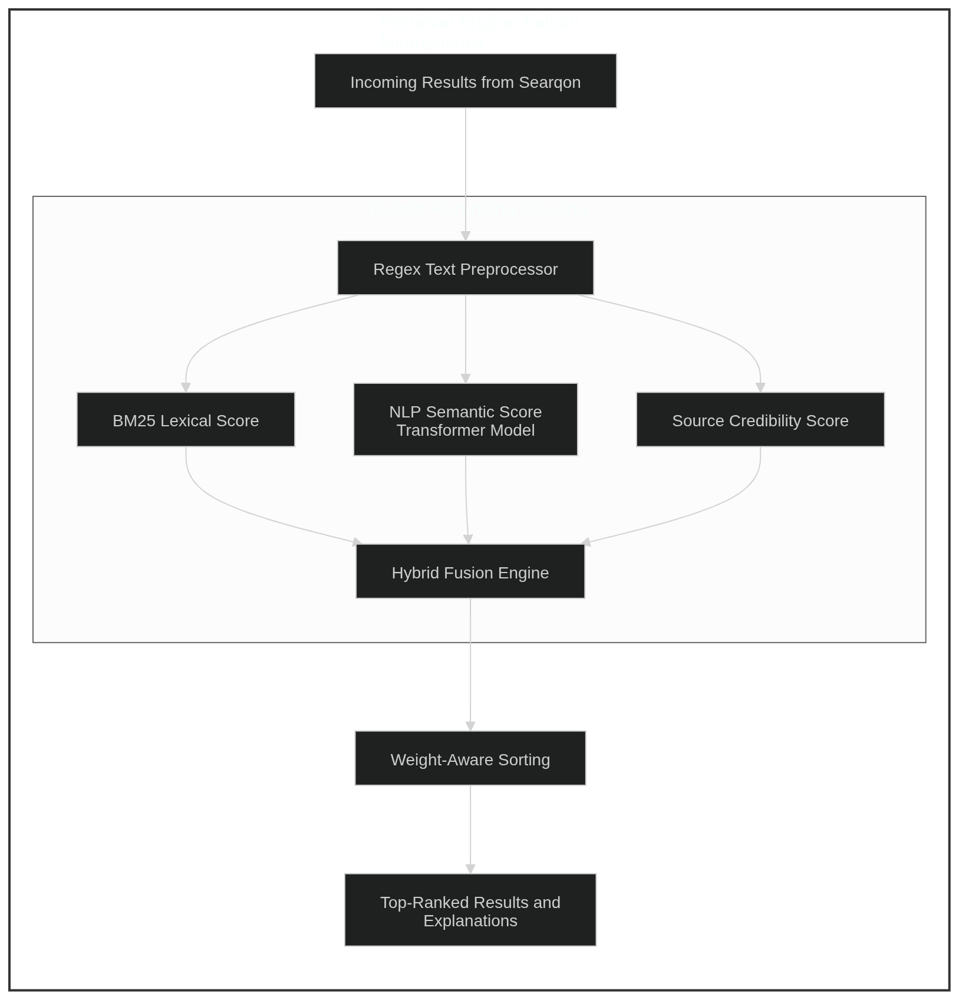

# Intelligent Retrieval & Reranking Strategy

Searqon doesn't just "fetch" links; it thinks about them. Once results are gathered from the web (Talven, DuckDuckGo, etc.), they pass through our **Intelligent Retrieval Engine** to ensure that the most accurate and trustworthy information reaches you first.

## How It Works (Simplified)

The engine follows a multi-stage "brain" process to evaluate every search result:

### 1. Pre-Processing

We strip away the noise. The engine uses a high-speed **Regex Preprocessor** to clean the text, remove "stop words" (like _the_, _is_, _at_), and prepare the content for deep analysis.

### 2. The Three-Pillar Scoring

Every result is graded on three distinct scales in parallel:

- **BM25 Lexical Score**: "How well do the keywords match?" This looks for the precise terminology you used.
- **NLP Semantic Score**: "What is the actual meaning?" Using a **Transformer Model**, the engine understands synonyms and context, even if the exact words don't match.
- **Source Credibility Score**: "Can we trust this?" It checks the domain authority (e.g., favoring Arxiv or Nature) and penalizes clickbait or low-quality sources.

### 3. Hybrid Fusion & Sorting

The **Hybrid Fusion Engine** takes those three scores and blends them together. It uses a weighted formula to decide the "Final Score." Finally, it re-orders the list so the "Winner" is at the top.

---

## ⚡ Dual-Mode Flexiblity

Since modern AI can be heavy, Searqon gives you two ways to run this engine:

### 🟢 Node.js Mode (`node_rerank`) - **The Fast Track**

- **Resource Usage**: Near Zero.
- **Best for**: Low-power servers or quick everyday searches.
- It performs the **BM25** and **Credibility** scoring natively in JavaScript for maximum speed.

### 🔵 Python Mode (`python_rerank`) - **The Deep Brain**

- **Resource Usage**: Normal (~400MB RAM).
- **Best for**: Research, AI Agents, and complex queries.
- It adds the **NLP Semantic Score** using a dedicated Python microservice, giving you the highest possible search intelligence.

> [!TIP]
> You can switch between these modes anytime in your `settings/settings.yaml` file!
