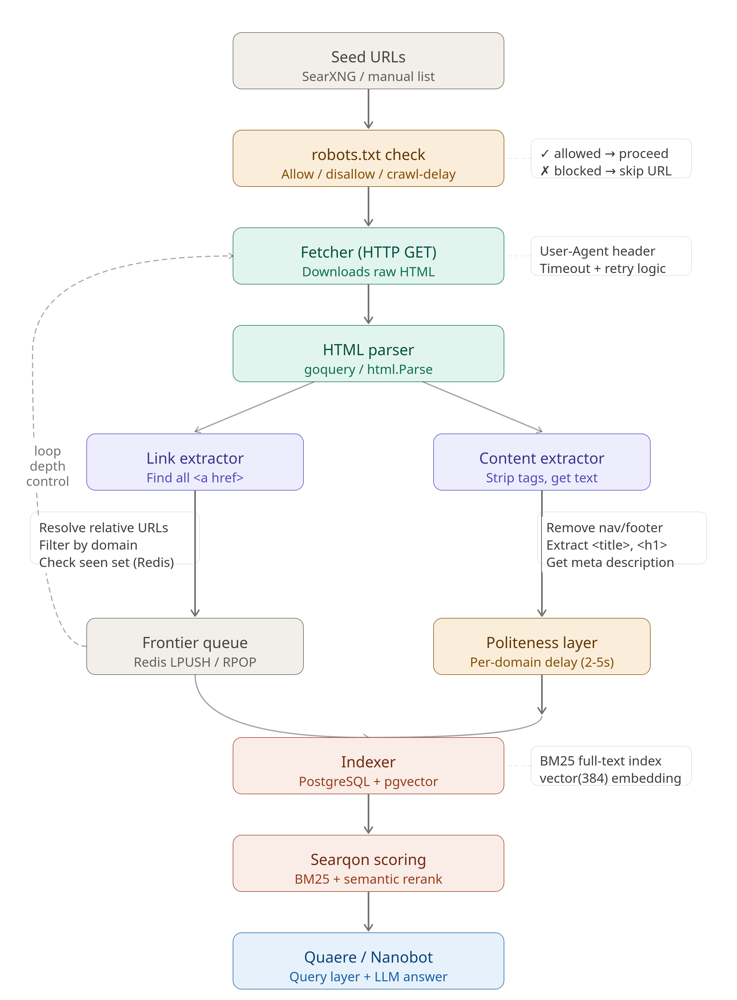

# Searqon Web Intelligence Engine: Scraping Pipeline

This document details the mechanics of Searqon's high-concurrency web scraping system. The scraper parses and cleans web page contents in parallel to provide structured markdown datasets for upstream AI models.

---

## Technical Scraping Architecture

The scraping process is governed by a strict concurrency limit and global timeout to prevent slow web servers from hanging the request execution.

---

## Pipeline Execution Stages

The scraping pipeline operates sequentially across these distinct stages:

### Stage 1: URL Deduplication
Before initiating any processing or network requests, the engine normalizes the discovered search URLs (e.g., stripping trailing slashes) and deduplicates them. This ensures that duplicate links returned across different search engines are discarded **before** any database lookups or robots.txt checks occur.

### Stage 2: Cache Check (PostgreSQL)
For each unique URL, the database cache is queried:
* **Bypass Cache**: If the request specifies `bypass_cache: true`, the cache is completely ignored.
* **TTL Age Check**: If a cached entry is found in `scrape_cache`, its age is validated against the TTL policy (`SCRAPE_CACHE_TTL_DAYS`).
* **Cache Hit / Miss**: Valid entries return immediately in under 5ms. Misses continue to the concurrency queue.

### Stage 3: Concurrency & Deadline Controls
To prevent resource exhaustion and request hangs:
* **Goroutine Cap**: A maximum of 3 concurrent page fetches (`scrapeLimit`) are dispatched.
* **8-Second Timeout**: The group is governed by a global `context.WithTimeout` set to 8000ms.
* **Mutex Locks**: Writes to the shared results array are synchronized using `sync.Mutex` to prevent race conditions as pages finish loading asynchronously.

### Stage 4: robots.txt Parser & Compliance
For each URL dispatched, the scraper first checks compliance with the host's crawling policy:
1. **Fetch & Cache**: Fetches the host's `robots.txt` and caches the rule payload (`robotsCache`) to avoid repetitive overhead.
2. **Agent Matching**: Searches for matching directives (`searqon`, generic search bots, or `*`).
3. **Crawl Delay Compliance**: Respects optional `Crawl-delay` timers via `time.Sleep`. If disallowed, execution stops immediately and writes a "disallowed by robots.txt" status directly to the database.

### Stage 4.5: Lightpanda Headless Scraper (Optional)
If allowed by `robots.txt`, the engine checks the `config.yaml` configuration:
* **Configuration Toggle**: Looks for `lightpanda: enabled: true` in the root configuration file.
* **Subprocess Execution**: If enabled, the engine launches Lightpanda as a subprocess to parse the webpage, execute any client-side JavaScript, and directly dump purified markdown.
* **Graceful Fallback**: If Lightpanda is disabled, missing, or fails to execute, the system falls back automatically to the native Go HTTP scraper.

### Stage 5: DOM Purging, Readability & Markdown (Go Native Scraper)
If Lightpanda is disabled or fails, the native Go scraper runs:
1. **Element Stripping**: Drops scripts, styles, iframes, SVGs, and header/footer templates.
2. **Readability Extraction**: Extracts the main content body using Mozilla's Readability algorithm.
3. **Markdown Conversion**: Converts the clean content block to structured markdown.

### Stage 6: Snippet Fallback on Failure
If a scraping worker fails (e.g., connection reset, DNS failure, blocked by CAPTCHA/robots.txt, or hitting the 8-second timeout), the engine falls back to the search engine snippet returned during Stage 1. This guarantees that client agents always receive context, even for unreachable websites.

### Stage 7: Persistent Write
Successfully scraped content and error states are written back to the PostgreSQL database for subsequent requests.

