# Searqon Web Intelligence Engine: Main Workflow

This document details the high-level request lifecycle, database query caching strategies, and the fallback discovery chain of the Searqon search pipeline.

---

## Technical Request Lifecycle

The main search execution flow coordinates query caching, third-party search provider aggregation, and fallback routing to deliver fast and reliable search results.



---

## Pipeline Execution Steps

The search pipeline runs through the following sequence for every client request:

### Step 1: Request Initialization
Clients query the search engine using either:
* **`GET /search?q=<query>&limit=5&scrape=true&bypass_cache=false`**
* **`POST /search`** with a JSON body:
  ```json
  {
    "query": "open claw agents",
    "limit": 5,
    "scrape": true,
    "bypass_cache": false
  }
  ```

### Step 2: Query Cache Lookup (Stage 0)
Before contacting any external networks, the engine queries the PostgreSQL `search_cache` table:
* **Cache Bypass**: Checked via `bypass_cache`. If `true`, the query continues to discovery.
* **TTL Check**: The database filters out queries older than the value set in `SEARCH_CACHE_TTL_HOURS` (defaults to 24 hours).
* **Cache Hit**: A clean result array is returned to the client in <5ms.

### Step 3: Provider Fallback Chain (Stage 1)
If the query results are not cached, Searqon starts the search provider discovery chain:
1. **Primary Provider (SearXNG)**: Queries the local instance (e.g. `http://localhost:8080/search`) requesting a JSON payload.
2. **Resilience Fallback (DuckDuckGo Lite)**: If the local SearXNG returns a 403, timed out, or is offline, Searqon falls back to DuckDuckGo's Lite HTML endpoint (`html.duckduckgo.com`).
3. **HTML Parsing**: Parses results using `goquery` to bypass DuckDuckGo's JavaScript protection layer.

### Step 4: URL Deduplication & Normalization
Discovered search URLs are normalized and filtered. Duplicate links are dropped to ensure clean inputs for the scraper.

### Step 5: Scraping Orchestration (Stage 3)
If `scrape` is set to `true`, the engine passes the top 3 unique results to the parallel scraper. This stage manages context timeouts, database page caching, and HTML readability extraction (detailed in [scraping.md](scraping.md)).

### Step 6: Persistent Write (Stage 4)
The completed search response payload is saved to the PostgreSQL `search_cache` table to speed up subsequent queries, then returned to the client.
